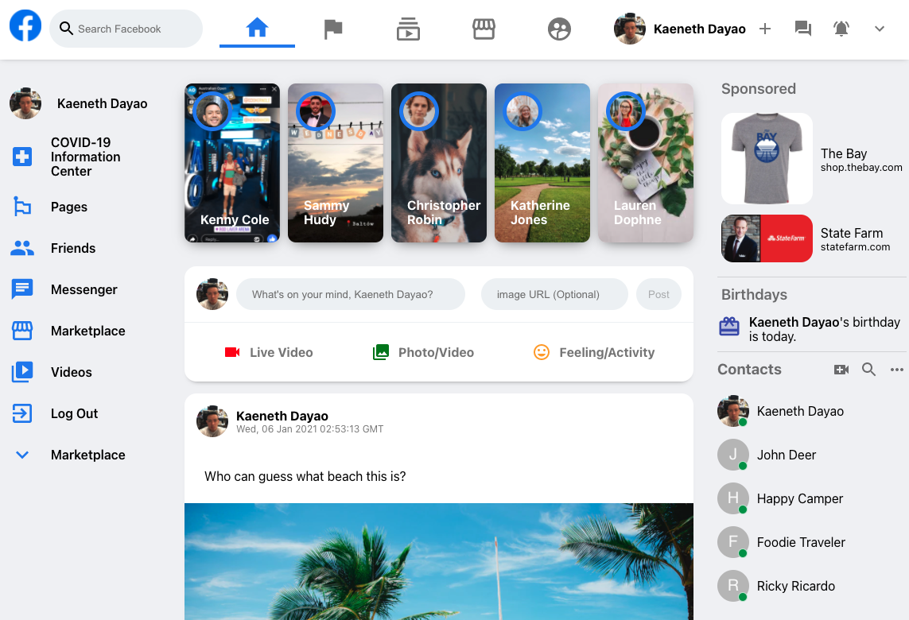

# Facebook-Clone

## Description

View contacts, post pictures, and update your status with this facebook clone application. Create your own account or log in with your gmail account. This application was built using React.js, Firebase for data storage and user authentication, Material UI for styling, and Context API from state management.

## Table of Contents

- [Description](#description)
- [Technology](#technology)
- [User Story](#user-story)
- [Installation](#installation)
- [Usage](#usage)
- [License](#license)
- [Contributing](#contributing)
- [Tests](#tests)
- [Questions](#questions)
- [Deployed Application URL](#deployed-application-URL)

## Technology

- React.js
- Firebase
- React Hooks
- Context API
- Material UI
- CSS
- HTML
- JavaScript

## User Story

## Installation

npm install in root folder to install dependancies for backend and frontend.

## Usage

The deployed link will take you to the login page. Click on create an account to create your own account, sign in to log in an existing account, or sign in via an existing google account. You can also log in using the credentials below. Once logged in, type in your status in the input field and click on post to post your status. Remember to log out when you are done!

Public Login Credentials

- email: cool_coder@email.com
- password: 12341234

## License

## Contributing

Please follow standard contributing guidelines.

## Tests

No tests to run.

## Questions

For any questions, please contact kendayao at kendayao@gmail.com

## Deployed Application URL

Deployed application link: https://facebook-clone-d025c.web.app

